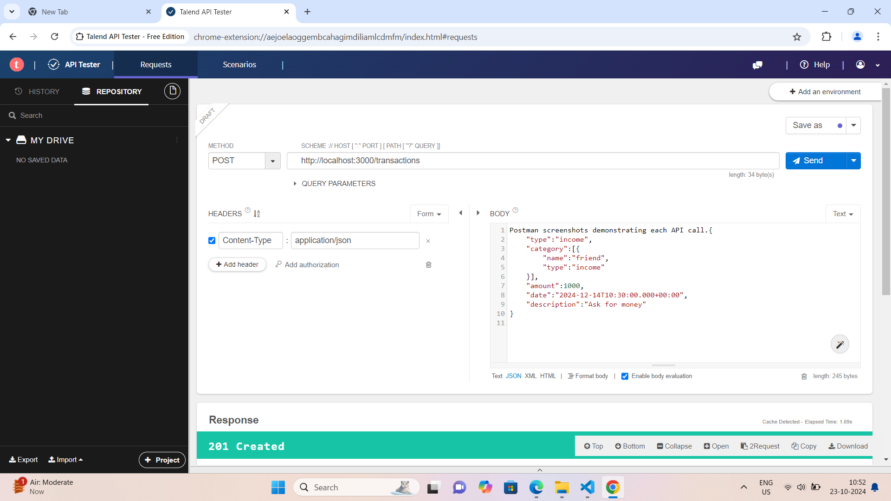
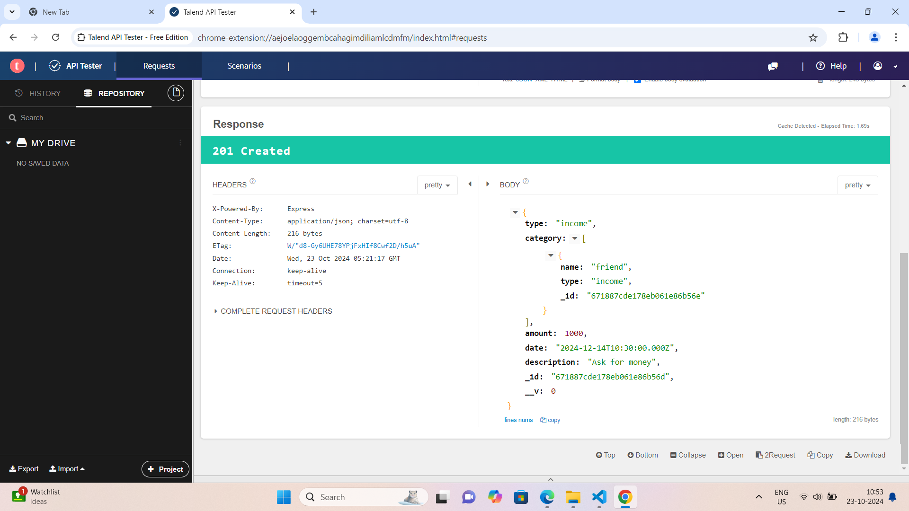
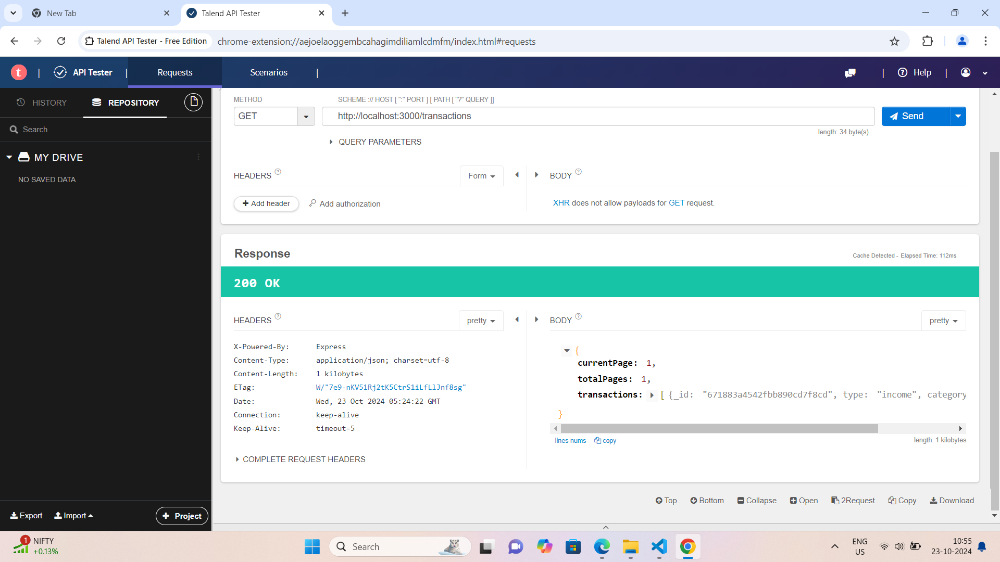
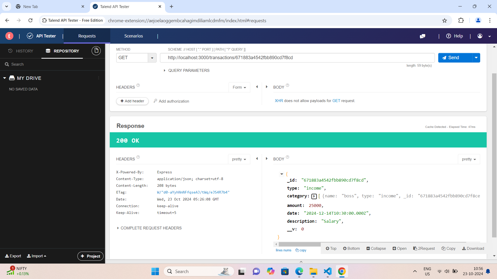
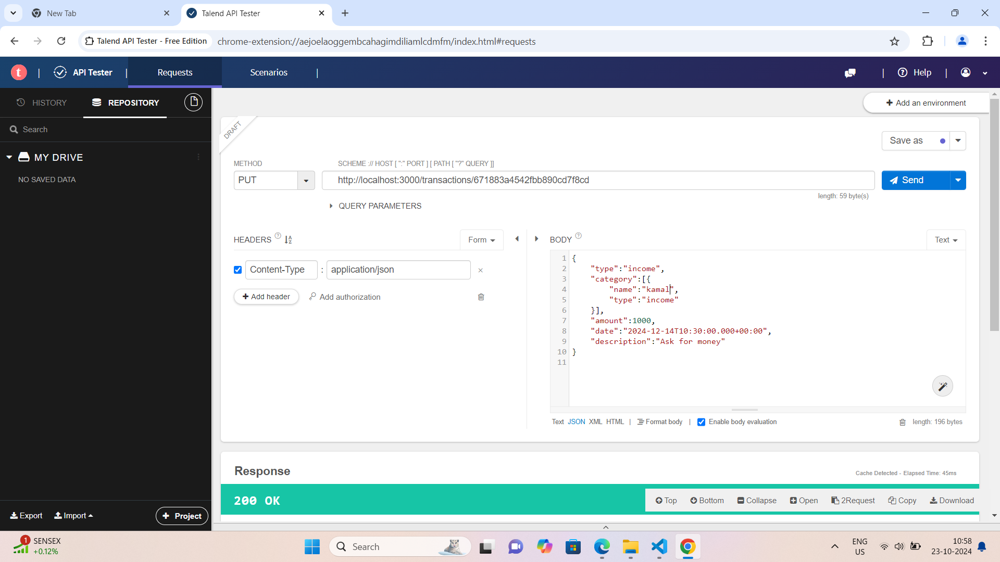
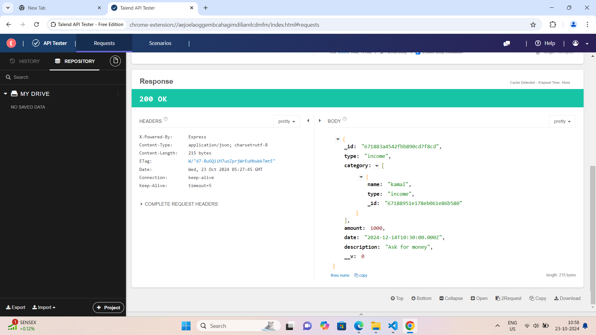
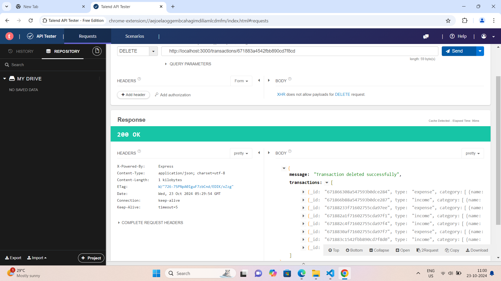
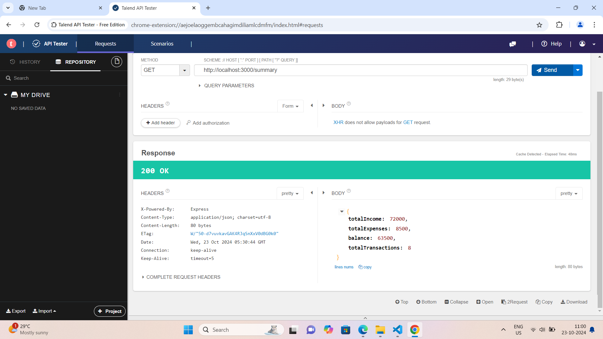

# Transaction Management API 
 
 This is a simple REASTAPI for managing financial transactions using Express and MongoDB 

# Features 

**Create Transaction**: Add new transactions with details such as type, category, amount, date, description 
**Retrive Trasactions**: Get a list of transactions with pagination 
**Retrive Transaction by ID**: Fetch the details by using a specific transaction ID
**Update Transaction by ID**: Modify the specific transaction by ID
**Delete Transaction by ID**: You can delete a specific transaction by ID
**Summary**: Retrive Total income, Total expenses, Balance, Total transactions 

# Setup and run instructions 

**Node.js**: Ensure you have nodejs installed in your system
**MongoDB**: Set up a MongoDB account and create a cluster. You can use MondoDB Atlas 

Open your terminal and run: npx nodemon index.js

# API Endpoints 

**POST /transactions**
  
  
  

**GET /transactions**
    

**GET /transactions/:id** 
    

**PUT /transactions/:id** 
   
   
   
   
In this Changed the name friend to kamal in category 

**DELETE /transactions/:id** 
   

**GET /summary**
      
